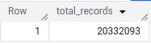
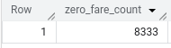

# README: BigQuery Analysis of 2024 Yellow Taxi Data

## Overview
This document provides an analysis of the 2024 Yellow Taxi data using BigQuery. The dataset contains taxi trip records, including pickup locations, drop-off locations, fare amounts, and other relevant details. The queries analyze the total number of records, distinct pickup locations, zero fare trips, estimated data size, and optimization strategies.

## Queries and Insights

### **1. Count of Records for the 2024 Yellow Taxi Data**
Query:
```sql
SELECT SUM(record_count) AS total_records
FROM (
    SELECT COUNT(*) AS record_count FROM `cohesive-pad-450612-m7.DatasetID.yellow_tripdata_2024-01`
    UNION ALL
    SELECT COUNT(*) FROM `cohesive-pad-450612-m7.DatasetID.yellow_tripdata_2024-02`
    UNION ALL
    SELECT COUNT(*) FROM `cohesive-pad-450612-m7.DatasetID.yellow_tripdata_2024-03`
    UNION ALL
    SELECT COUNT(*) FROM `cohesive-pad-450612-m7.DatasetID.yellow_tripdata_2024-04`
    UNION ALL
    SELECT COUNT(*) FROM `cohesive-pad-450612-m7.DatasetID.yellow_tripdata_2024-05`
    UNION ALL
    SELECT COUNT(*) FROM `cohesive-pad-450612-m7.DatasetID.yellow_tripdata_2024-06`
);
```

- 20,332,093




### **2. Estimated Amount of Data**

- 0 MB for the External Table and 155.12 MB for the Materialized Table


### **3. Why Are the Estimated Bytes Different?**
**Answer Choices:**
- BigQuery is a columnar database, and it only scans the specific columns requested in the query. Querying two columns (PULocationID, DOLocationID) requires reading more data than querying one column (PULocationID), leading to a higher estimated number of bytes processed.

- BigQuery stores data in a columnar format, meaning it only reads the specific columns you select.
- If you query only PULocationID, BigQuery scans just that column.
- If you query both PULocationID and DOLocationID, it scans both columns, increasing the estimated bytes processed.


### **4. Number of Records with a Fare Amount of 0**
Query:
```sql
SELECT COUNT(*) AS zero_fare_count
FROM `cohesive-pad-450612-m7.DatasetID.yellow_tripdata_2024-*`
WHERE fare_amount = 0;
```
- 8,333



### **5. Best Strategy for Optimizing the Table in BigQuery**

- Partition by tpep_dropoff_datetime and Cluster on VendorID

- `Partitioning by tpep_dropoff_datetime`: Since taxi trip data is time-based, partitioning by the drop-off datetime improves query performance when filtering by date/time. This reduces the amount of scanned data for time-based queries (e.g., "trips in January 2024").
- `Clustering by VendorID`: Clustering organizes data within partitions, making queries on VendorID more efficient. Queries filtering by VendorID (e.g., "trips by Vendor A") will scan fewer rows within each partition.

### **6. Estimated Processed Bytes**
- 310.24 MB for non-partitioned table and 26.84 MB for the partitioned table
- Partitioning reduces the amount of data scanned because only the relevant partitions are read instead of the entire table. In a non-partitioned table, BigQuery scans the entire dataset when executing a query, leading to higher data processing. In a partitioned table, only the relevant partitions are scanned, significantly reducing the amount of data processed. The drop from 310.24 MB to 26.84 MB shows the effectiveness of partitioning, especially when filtering by tpep_dropoff_datetime.


### **7. Where is the Data for External Tables Stored?**

- GCP Bucket


### **8. Always Clustering**

- False


