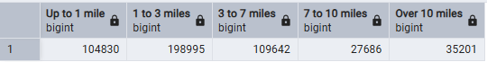

## Module 1 Homework: Docker & SQL
### Question 1
- Run docker with the python:3.12.8 image in an interactive mode, use the entrypoint bash and check the version of pip in the image.

```bash
docker run -it --entrypoint=bash python:3.12.8 

pip --version
```
- Output: `24.3.1`

### Question 2
- Determining  the hostname and port that pgadmin should use to connect to the postgres database.

`postgres:5433`

### Question 3
```sql
SELECT 
    SUM(CASE WHEN trip_distance <= 1 THEN 1 ELSE 0 END) AS "Up to 1 mile",
    SUM(CASE WHEN trip_distance > 1 AND trip_distance <= 3 THEN 1 ELSE 0 END) AS "1 to 3 miles",
    SUM(CASE WHEN trip_distance > 3 AND trip_distance <= 7 THEN 1 ELSE 0 END) AS "3 to 7 miles",
    SUM(CASE WHEN trip_distance > 7 AND trip_distance <= 10 THEN 1 ELSE 0 END) AS "7 to 10 miles",
    SUM(CASE WHEN trip_distance > 10 THEN 1 ELSE 0 END) AS "Over 10 miles"
FROM 
    green_taxi_data
WHERE 
    lpep_pickup_datetime BETWEEN '2019-10-01' 
    AND '2019-11-01';
```
- Output 
- 

### Question 4
 - The pick up day with the longest trip distance
 `2019-10-31`
```sql
SELECT 
    pickup_day,
    longest_trip_distance
FROM (
    SELECT 
        DATE(lpep_pickup_datetime) AS pickup_day,
        MAX(trip_distance) AS longest_trip_distance
    FROM 
        green_taxi_data
    WHERE 
        DATE(lpep_pickup_datetime) IN ('2019-10-11', '2019-10-24', '2019-10-26', '2019-10-31')
    GROUP BY 
        DATE(lpep_pickup_datetime)
) AS daily_longest_trips
ORDER BY 
    longest_trip_distance DESC
LIMIT 1;

```
- 

### Question 5
- Three Biggest pickup zones

```sql
SELECT 
    z."Zone" AS pickup_zone,
    SUM(g."total_amount") AS total_amount
FROM 
    green_taxi_data g
JOIN 
    zones z
ON 
    g."PULocationID" = z."LocationID"
WHERE 
    DATE(g."lpep_pickup_datetime") = '2019-10-18'
GROUP BY 
    z."Zone"
HAVING 
    SUM(g."total_amount") > 13000
ORDER BY 
    total_amount DESC;
```

- 

### Question 6
- Drop off zone with the largest tip
```sql
SELECT 
    drop_zones."Zone" AS dropoff_zone,
    MAX(g."tip_amount") AS largest_tip
FROM 
    green_taxi_data g
JOIN 
    zones pickup_zones
ON 
    g."PULocationID" = pickup_zones."LocationID"
JOIN 
    zones drop_zones
ON 
    g."DOLocationID" = drop_zones."LocationID"
WHERE 
    pickup_zones."Zone" = 'East Harlem North'
    AND DATE(g."lpep_pickup_datetime") BETWEEN '2019-10-01' AND '2019-10-31'
GROUP BY 
    drop_zones."Zone"
ORDER BY 
    largest_tip DESC
LIMIT 1;
```
- 